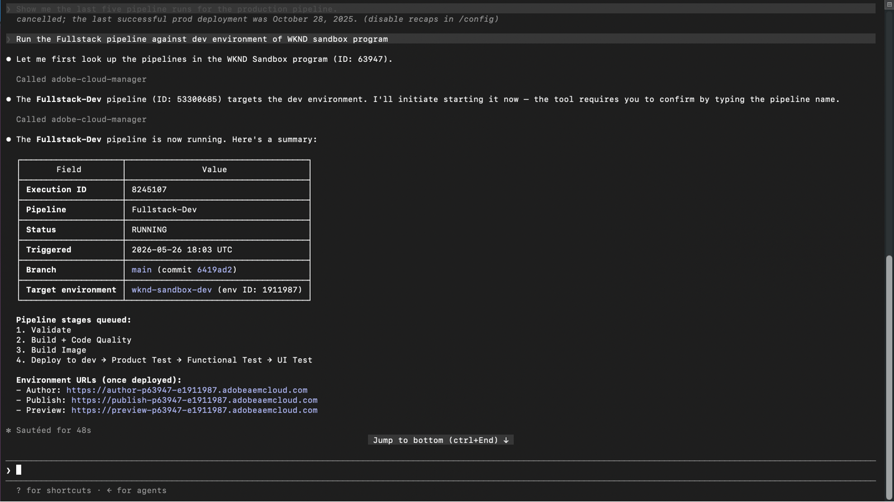

# Implante no AEM as a Cloud Service com confiança

<!-- last-modified: 2026-05-21 -->

>[!VIDEO](https://video.tv.adobe.com/v/3480340/?learn=on&enablevpops)

A confiança na implantação vem de saber que seu ambiente está saudável antes de você forçar. Esta apresentação mostra como verificar o status do ambiente do AEM, revisar o histórico do pipeline e acionar implantações de um cliente de IA usando o servidor MCP do AEM Cloud Manager, para que as equipes possam se mover rapidamente sem perder visibilidade.

| Detalhes do cenário | |
| --- | --- |
| Aplicativos corporativos CX | [Adobe Experience Manager Cloud Manager](https://experienceleague.adobe.com/en/docs/experience-manager-cloud-service/content/implementing/using-cloud-manager/introduction-to-cloud-manager) |
| Ferramentas de agilidade | [AEM Cloud Manager MCP Server](https://experienceleague.adobe.com/pt-br/docs/experience-manager-learn/cloud-service/ai/mcp-servers/cloud-manager) |
| Público-alvo | Desenvolvedores, DevOps, equipes de operações |
| Pré-requisito | Cliente de IA compatível com MCP, acesso ao AEM Cloud Manager |

Cada etapa mostra um prompt representativo e um exemplo de resposta de IA. Segue-se um **Mais prompts para tentar a seção** para exploração adicional na mesma sessão.

## Antes de começar

>[!BEGINTABS]

>[!TAB Código Claude]

Navegue até o diretório do projeto primeiro e, em seguida, adicione o servidor MCP Cloud Manager usando a CLI:

```bash
claude mcp add --transport http adobe-cloud-manager https://mcp.adobeaemcloud.com/adobe/mcp/cloudmanager
```

Ou adicione-o manualmente a `.mcp.json` na raiz do projeto:

```json
{
  "mcpServers": {
    "adobe-cloud-manager": {
      "type": "http",
      "url": "https://mcp.adobeaemcloud.com/adobe/mcp/cloudmanager"
    }
  }
}
```

Reinicie o código Claude. As ferramentas do Cloud Manager estão disponíveis na próxima sessão.

Configuração completa: [documentação MCP do Claude Code](https://docs.anthropic.com/en/docs/claude-code/mcp)

>[!TAB Cursor]

Adicionar o Servidor MCP do Cloud Manager a `~/.cursor/mcp.json` (global) ou `.cursor/mcp.json` na raiz do projeto:

```json
{
  "mcpServers": {
    "adobe-cloud-manager": {
      "type": "http",
      "url": "https://mcp.adobeaemcloud.com/adobe/mcp/cloudmanager"
    }
  }
}
```

Abra **Configurações > MCP**, selecione **Conectar** ao lado do servidor e entre com sua Adobe ID.

Configuração completa: [Documentação de MCP do cursor](https://cursor.com/docs/mcp)

>[!TAB GitHub Copilot]

Adicionar o Servidor MCP do Cloud Manager a `.vscode/mcp.json` na raiz do projeto:

```json
{
  "servers": {
    "adobe-cloud-manager": {
      "type": "http",
      "url": "https://mcp.adobeaemcloud.com/adobe/mcp/cloudmanager"
    }
  }
}
```

Observação: o Código VS usa `"servers"` como chave de nível superior, não `"mcpServers"`.

Abra o painel **GitHub Copilot Chat**, alterne para o **modo Agente** e selecione **Conectar** ao lado do servidor. As ferramentas de MCP só estão disponíveis no modo Agente.

Configuração completa: [documentação de servidores MCP de código VS](https://code.visualstudio.com/docs/copilot/customization/mcp-servers)

>[!TAB Outros clientes de IA]

Usar outro ambiente compatível com MCP? Conecte-se ao Servidor MCP do Cloud Manager usando este endpoint:

```
https://mcp.adobeaemcloud.com/adobe/mcp/cloudmanager
```

Instruções completas de instalação para todos os clientes com suporte: [Conecte-se ao cliente de IA](../tools/mcp-servers.md)

>[!ENDTABS]

>[!NOTE]
>
>Faça logon com sua Adobe ID quando solicitado e selecione a organização IMS vinculada ao seu programa AEM as a Cloud Service. As permissões são aplicadas no nível da Cloud Manager. O cliente de IA só pode executar operações para as quais sua conta está autorizada.
>
>Na primeira conexão, o cliente de IA pode solicitar que você confirme sua organização ou programa do AEM. Depois que o contexto é definido, o servidor MCP o utiliza para o restante da sessão.
>
>Algumas ferramentas solicitam sua aprovação antes de serem executadas. Revise a ação proposta e aprove ou recuse. Nenhuma ação é executada sem a sua confirmação.

## Etapa 1: verificar o status do ambiente

Antes de iniciar uma versão, confirme se os ambientes estão íntegros e se nada está sendo executado ativamente.

```
What is the status of the production environment?
```

+++Ver um exemplo de resposta


+++


## Etapa 2: revisar execuções de pipeline

Revise o histórico recente de pipelines para entender os padrões de implantação e detectar falhas antes que eles bloqueiem sua próxima versão.

```
Show me the last five pipeline runs for the production pipeline.
```

+++Ver um exemplo de resposta


+++


## Etapa 3: acionar um pipeline

Inicie uma execução de pipeline diretamente do seu cliente de IA. O servidor confirma o ambiente de destino e solicita aprovação antes de iniciar.

```
Run the Fullstack pipeline against dev environment of WKND sandbox program.
```

+++Ver um exemplo de resposta



+++


>[!CAUTION]
>
>O cliente da IA solicitará que você confirme o nome do pipeline antes de acionar uma execução. Insira o nome exato do pipeline para continuar. Revise o ambiente de destino cuidadosamente antes de confirmar, especialmente para pipelines que são implantados na produção.

## Etapa 4: verificar o status do pipeline

Depois de acionar uma execução, peça ao cliente de IA uma atualização de status sem alternar para a interface do Cloud Manager.

```
What is the status of the triggered pipeline?
```

+++Ver um exemplo de resposta


+++


## O que você realizou

Você usou o AEM Cloud Manager MCP Server para verificar a integridade do ambiente, revisar o histórico do pipeline, acionar uma implantação e verificar seu status, sem abrir a interface do Cloud Manager. Ao combinar a visibilidade do ambiente e o controle de implantação em uma única sessão de IA, as equipes de desenvolvimento e operações podem responder aos problemas com mais rapidez e manter o fluxo de trabalho dentro das ferramentas que já usam.

## Mais você pode realizar

O Cloud Manager MCP Server lida com muito mais do que a apresentação acima cobre. Expanda um cenário abaixo para ver os prompts que você pode tentar na mesma sessão.

+++Capturar problemas antes de uma liberação ser enviada

As implantações geralmente falham por motivos que eram visíveis antes da execução do pipeline. Esses prompts ajudam a confirmar a integridade do ambiente, verificar execuções conflitantes e verificar o alinhamento da versão entre ambientes antes de confirmar uma versão.

**Solicitações**

```
We're about to kick off a production release. Give me a full status check on all environments first.
```

```
Is there anything currently running in the staging pipeline? I don't want to queue on top of an active run.
```

```
Before I promote main branch to production, confirm main was deployed to Dev and all environments are on the same AEM version.
```

```
What repositories are connected to the WKND program?
```

+++

+++Correção do curso de uma implantação que já está em andamento

Um acionador acidental ou uma porta de aprovação paralisada pode entrar em cascata em um pipeline bloqueado ou em uma implantação indesejada. Esses prompts permitem cancelar ou avançar um pipeline em execução sem alternar para a interface do Cloud Manager.

**Solicitações**

```
The staging pipeline kicked off by mistake. Cancel it before it deploys.
```

```
The release pipeline is waiting at the approval gate. Advance it to continue the deployment.
```

+++

+++Entenda seu histórico de implantação

Saber quando as coisas tiveram êxito pela última vez, quanto tempo os pipelines são executados e se os padrões estão mudando ajuda a planejar as liberações e detectar a degradação lenta antes que se torne um incidente. Use esses prompts para obter esse histórico sob demanda.

**Solicitações**

```
What is the status of the last production pipeline execution? If it failed, explain why.
```

```
When was the last successful deployment to the staging environment?
```

```
Our pipeline times are creeping up. What's the longest run we've had in the last 30 days?
```

+++

+++Recuperação de um build quebrado nos trilhos

Quando um pipeline falha, o caminho mais rápido para a resolução é entender exatamente onde ele se quebrou e por quê. Esses prompts fornecem detalhes de falha de superfície, histórico de alterações e problemas de quality gate (porta de qualidade) para que sua equipe possa diagnosticar e corrigir sem analisar manualmente os logs.

**Solicitações**

```
We're seeing a regression on the live site. What changed in production over the last week?
```

```
Which pipelines have failed in the last 7 days, and at what stage did they fail?
```

```
The last pipeline failed at the code quality step. What specific issues need to be fixed before I can retry?
```

```
Pull the step logs for the last failed run. I need to see exactly what the quality gate flagged.
```

+++


## Informações adicionais

| Recurso | O que você encontrará |
| --- | --- |
| [Documentação do AEM as a Cloud Service](https://experienceleague.adobe.com/pt-br/docs/experience-manager-cloud-service){target="_blank"} | Documentação completa do aplicativo do AEM |
