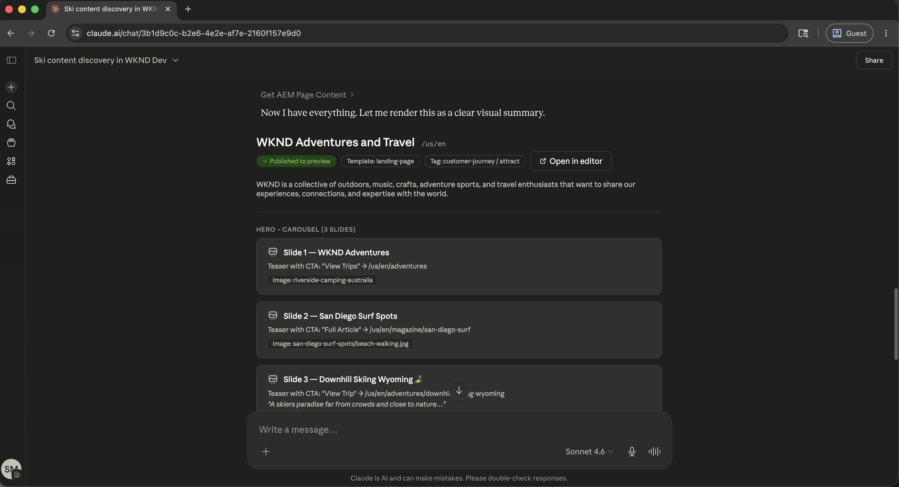

# Mantenha o conteúdo atualizado e envie atualizações com mais rapidez

<!-- last-modified: 2026-05-22 -->


As operações de conteúdo no Adobe Experience Manager, desde encontrar páginas e revisar conteúdo até fazer atualizações e publicar, normalmente exigem navegar diretamente pela interface do AEM. Esta apresentação mostra como lidar com essas operações por meio de um cliente de IA usando o servidor MCP de conteúdo do AEM, para que as equipes de conteúdo possam mover-se mais rapidamente sem alternar o contexto entre as ferramentas.

| Detalhes do cenário | |
| --- | --- |
| Aplicativos corporativos CX | [Adobe Experience Manager as a Cloud Service](https://experienceleague.adobe.com/en/docs/experience-manager-cloud-service/content/overview/introduction?lang=pt-BR) |
| Ferramentas de agilidade | [Servidor MCP de Conteúdo do AEM](https://experienceleague.adobe.com/en/docs/experience-manager-cloud-service/content/ai-in-aem/using-mcp-with-aem-as-a-cloud-service) |
| Público-alvo | Gerentes de conteúdo, equipes de marketing |
| Pré-requisito | Cliente de IA compatível com MCP, acesso ao AEM as a Cloud Service |

Cada etapa mostra um prompt representativo e um exemplo de resposta de IA. Segue-se uma seção **Mais que você pode realizar** para exploração adicional na mesma sessão.

## Antes de começar

>[!BEGINTABS]

>[!TAB Claude.ai]

Conecte o AEM Content MCP Server como um conector personalizado.

1. Vá para **Configurações > Integrações** em Claude.ai.
2. Selecione **Adicionar conector personalizado** e insira a URL do servidor: `https://mcp.adobeaemcloud.com/adobe/mcp/content`
3. Selecione **Conectar** e entre com sua Adobe ID.

Configuração completa: [documentação dos Conectores personalizados do Claude.ai](https://support.claude.com/en/articles/11175166-get-started-with-custom-connectors-using-remote-mcp)

>[!TAB GPTchat]

Conecte o Servidor de MCP de Conteúdo do AEM usando o Modo de Desenvolvedor ChatGPT (plano Pro, Plus, Business, Enterprise ou Education necessário).

1. Habilite o **Modo de Desenvolvedor** em **Configurações de ChatGPT**.
2. Vá para **Configurações > Integrações** e selecione **Adicionar conector personalizado > Servidor MCP remoto**.
3. Digite a URL do servidor: `https://mcp.adobeaemcloud.com/adobe/mcp/content`
4. Selecione **Conectar** e entre com sua Adobe ID.

Configuração completa: [Documentação de MCP ChatGPT](https://developers.openai.com/api/docs/guides/tools-connectors-mcp)

>[!TAB Outros clientes de IA]

Usando Gemini, Microsoft Copilot, Cursor, Claude Code ou outro ambiente compatível com MCP? Conecte-se ao Servidor MCP de Conteúdo do AEM usando este endpoint:

```
https://mcp.adobeaemcloud.com/adobe/mcp/content
```

Instruções completas de instalação para todos os clientes com suporte: [Conecte-se ao cliente de IA](../tools/mcp-servers.md)

>[!ENDTABS]

>[!NOTE]
>
>Faça logon com sua Adobe ID quando solicitado e selecione a organização IMS vinculada ao seu ambiente AEM as a Cloud Service. As permissões são aplicadas no nível da AEM. O cliente de IA só pode executar operações para as quais sua conta está autorizada.
>
>Se você precisar apenas navegar ou auditar o conteúdo sem fazer alterações, use o ponto de extremidade do servidor Somente Leitura: `https://mcp.adobeaemcloud.com/adobe/mcp/content-readonly`. Todos os prompts de descoberta e revisão desta página funcionam com ambos os servidores.
>
>Na primeira conexão, o cliente de IA pode solicitar que você confirme a organização ou o ambiente do AEM. Depois que o contexto é definido, o servidor MCP o utiliza para o restante da sessão.
>
>Algumas ferramentas solicitam sua aprovação antes de serem executadas. Revise a ação proposta e aprove ou recuse. Nenhuma alteração será feita sem a sua confirmação.

## Etapa 1: encontrar conteúdo no ambiente do AEM

Comece pedindo ao cliente de IA que descubra os ambientes do AEM e pesquise o conteúdo. Você pode pesquisar por tópico, palavra-chave ou tipo de conteúdo sem conhecer os caminhos exatos.

```
From WKND Dev environment, find all ski related content.
```

+++Ver um exemplo de resposta


+++


## Etapa 2: revisar uma página específica

Depois de localizar o conteúdo relevante, peça ao cliente de IA para mostrar uma página específica. É possível consultar as páginas por nome ou caminho. O servidor MCP resolve a referência e retorna a estrutura do conteúdo.

```
Show me the US English Home Page.
```

+++Ver um exemplo de resposta



+++


## Etapa 3: Melhorar o conteúdo

Com o conteúdo da página em exibição, peça ao cliente de IA para sugerir ou aplicar melhorias. A IA pode propor alterações de cópia com base no que a página diz atualmente e solicitar confirmação antes de escrever qualquer coisa.

```
Improve the Hero CTAs.
```

+++Ver um exemplo de resposta


+++


>[!CAUTION]
>
>Confirme cada alteração quando solicitado. O AEM Content MCP Server pode criar, atualizar e excluir conteúdo. Revise a alteração proposta antes de aprová-la, especialmente em páginas ativas.

## Etapa 4: publicar e compartilhar

Depois de confirmar a atualização, publique a página e recupere um URL compartilhável, tudo na mesma conversa.

```
Publish the changes and share the URL.
```

+++Ver um exemplo de resposta


+++


## O que você realizou

Você usou o Servidor MCP de Conteúdo do AEM para localizar conteúdo, revisar uma página ao vivo, aplicar as melhorias sugeridas pela IA e publicar o resultado, sem abrir a interface do AEM. Ao combinar a descoberta, a edição e a publicação de conteúdo em uma única sessão de IA, as equipes de conteúdo podem mudar da identificação de uma lacuna para o envio de uma atualização mais rápido e com menos alternâncias de contexto. O mesmo fluxo de trabalho é dimensionado para várias páginas, fragmentos de conteúdo e lançamentos coordenados de campanha.

## Mais você pode realizar

O AEM Content MCP Server lida com muito mais do que as capas de apresentação. Expanda um cenário abaixo para ver os prompts que você pode tentar na mesma sessão.

+++Antecipe-se a uma revisão ou reinicialização do site

As auditorias de conteúdo são demoradas quando feitas manualmente. Esses prompts ajudam a exibir rapidamente o conteúdo obsoleto, rascunhos que nunca foram enviados e lacunas que precisam ser corrigidas antes de um push importante.

**Solicitações**

```
Show me everything updated in the last two weeks.
```

```
What content is sitting in draft and hasn't been published yet?
```

```
Find pages that haven't been touched in over a year.
```

```
Which pages are missing their description field?
```

```
We're reorganizing the taxonomy. Find all articles missing tags or categories.
```

+++

+++Correção de problemas de SEO e acessibilidade em escala

As lacunas de SEO e acessibilidade se multiplicam rapidamente em sites grandes. Esses prompts ajudam a localizar e priorizar os problemas mais importantes antes de uma auditoria ou inicialização.

**Solicitações**

```
Pull a list of all pages with an empty meta description.
```

```
Which pages have thin content that's likely to underperform for SEO?
```

```
Find all images missing alt text.
```

```
Our CTAs aren't consistent. Scan the site and flag anywhere the call-to-action wording differs from "Book now."
```

```
The homepage was updated yesterday. Show me what changed compared to the version before.
```

+++

+++Mantenha sua biblioteca de ativos organizada e pronta

Referências de ativos quebrados e uploads não processados retardam a produção de conteúdo. Esses prompts ajudam a localizar e gerenciar ativos antes que eles bloqueiem uma atualização de página ou campanha.

**Solicitações**

```
We're building a biking content series. What image assets do we already have?
```

```
Can you upload a placeholder asset from https://placehold.co/800x450/png to the wknd folder and save it as placeholder.png?
```

```
That asset was just uploaded. Is it processed and ready to use in a page?
```

```
I need to replace the hero image across the site. Which fragments are currently using it?
```

+++

+++Coordenar uma inicialização de conteúdo em várias páginas

Iniciar uma campanha geralmente significa coordenar as alterações em vários fragmentos de conteúdo e páginas. Esses prompts ajudam a agrupar as atualizações, revisar antes de promover e enviar sem problemas.

**Solicitações**

```
I need to update the surfing adventure. Show me its content and all its fields.
```

```
Create an EMEA market variation of the ski adventure fragment.
```

```
Bundle everything we changed in this session into a launch called May Updates.
```

```
What launches are open right now, and which ones are ready to promote?
```

```
Before I promote, show me exactly what changed between May Updates and what is currently live.
```

```
Promote the May Updates launch to production.
```

+++


## Informações adicionais

| Recurso | O que você encontrará |
| --- | --- |
| [Servidor MCP de Conteúdo do AEM no Registro de IA](https://developer.adobe.com/ai-registry/#/mcp/aem-content-mcp){target="_blank"} | Lista de ferramentas e disponibilidade |
| [Documentação do AEM as a Cloud Service](https://experienceleague.adobe.com/en/docs/experience-manager-cloud-service){target="_blank"} | Documentação completa do aplicativo do AEM |
