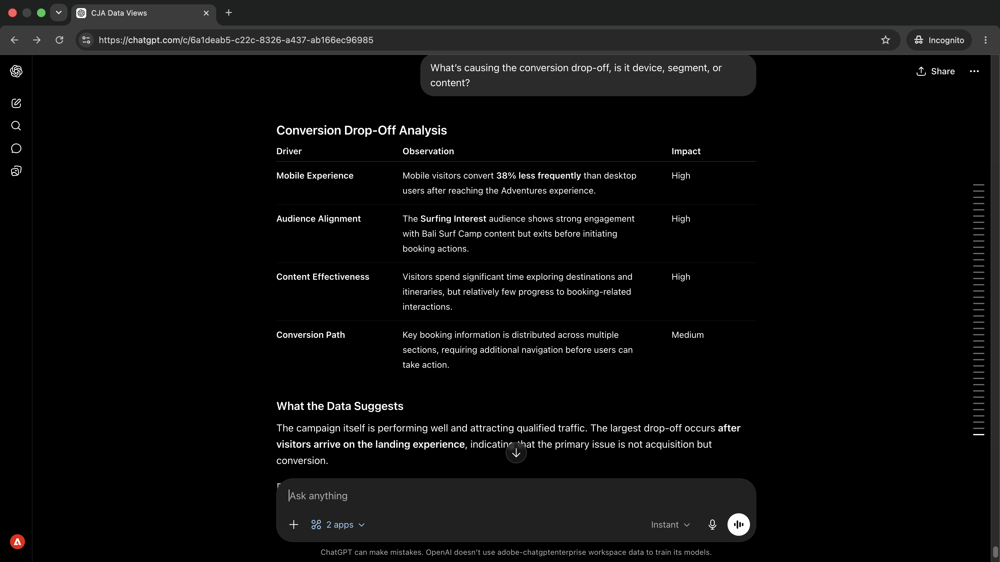

# Otimizar o conteúdo com base nos dados de desempenho
<!-- last-modified: 2026-06-08 -->


Fechar o loop entre os dados de desempenho da campanha e as atualizações de conteúdo normalmente significa alternar entre a ferramenta de análise e o CMS. Esta apresentação mostra como conectar o Customer Journey Analytics e o AEM na mesma sessão de IA: destacar campanhas com lacunas de conversão, diagnosticar o que as está impulsionando, inspecionar o conteúdo, obter recomendações direcionadas e aplicar alterações sem sair da conversa.

| | |
| --- | --- |
| Aplicativos corporativos CX | Customer Journey Analytics, Adobe Experience Manager as a Cloud Service |
| Ferramentas de agilidade | Gateway CX Enterprise MCP, servidor AEM Content MCP |
| Público-alvo | Gerentes de campanha, estrategistas de conteúdo, operações de marketing |
| Pré-requisito | Cliente de IA compatível com MCP, acesso CJA, acesso AEM as a Cloud Service |

Cada etapa mostra um prompt representativo e um exemplo de resposta de IA. Segue-se uma seção **Mais que você pode realizar** para exploração adicional na mesma sessão.


## Antes de começar

>[!BEGINTABS]

>[!TAB Claude.ai]

Conecte ambos os servidores MCP como conectores personalizados. Adicione cada um separadamente.

1. Vá para **Configurações > Integrações** em Claude.ai.
2. Selecione **Adicionar conector personalizado**, insira uma URL de servidor e selecione **Conectar**.
3. Faça logon com a Adobe ID e repita para o segundo servidor.

| Servidor | Endpoint |
| --- | --- |
| Gateway CX Enterprise MCP | `https://cx-enterprise.adobe.io/mcp` |
| Servidor MCP de conteúdo do AEM | `https://mcp.adobeaemcloud.com/adobe/mcp/content` |

Configuração completa: [documentação dos Conectores personalizados do Claude.ai](https://support.claude.com/en/articles/11175166-get-started-with-custom-connectors-using-remote-mcp)

>[!TAB GPTchat]

Conecte ambos os servidores MCP usando o modo de desenvolvedor ChatGPT (plano Pro, Plus, Business, Enterprise ou Education necessário). Adicione cada servidor separadamente.

1. Habilite o **Modo de Desenvolvedor** em **Configurações de ChatGPT**.
2. Vá para **Configurações > Integrações** e selecione **Adicionar conector personalizado > Servidor MCP remoto**.
3. Insira uma URL de servidor, selecione **Conectar** e entre com sua Adobe ID.
4. Repita o procedimento para o segundo servidor.

| Servidor | Endpoint |
| --- | --- |
| Gateway CX Enterprise MCP | `https://cx-enterprise.adobe.io/mcp` |
| Servidor MCP de conteúdo do AEM | `https://mcp.adobeaemcloud.com/adobe/mcp/content` |

Configuração completa: [Documentação de MCP ChatGPT](https://developers.openai.com/api/docs/guides/tools-connectors-mcp)

>[!TAB Outros clientes de IA]

Usando Gemini, Microsoft Copilot, Cursor, Claude Code ou outro ambiente compatível com MCP? Conecte-se a ambos os servidores MCP usando estes pontos finais:

| Servidor | Endpoint |
| --- | --- |
| Gateway CX Enterprise MCP | `https://cx-enterprise.adobe.io/mcp` |
| Servidor MCP de conteúdo do AEM | `https://mcp.adobeaemcloud.com/adobe/mcp/content` |

Instruções completas de instalação para todos os clientes com suporte: [Conecte-se ao cliente de IA](../tools/mcp-servers.md)

>[!ENDTABS]

>[!NOTE]
>
>Faça logon com sua Adobe ID quando solicitado e selecione a organização IMS vinculada aos seus ambientes do CJA e do AEM. Escolher a organização errada é a fonte mais comum de erros de autenticação.
>
>Na primeira conexão, o cliente de IA pode solicitar que você selecione uma organização IMS ou especifique uma sandbox. Depois que o contexto é definido, o servidor MCP o utiliza para o restante da sessão.
>
>Algumas ferramentas solicitam sua aprovação antes de serem executadas. Revise a solicitação e aprove ou recuse — nenhuma ação é executada sem sua confirmação.


## Etapa 1: encontrar campanhas com uma lacuna de conversão

Use o CJA para mostrar campanhas em que o click-through é forte, mas a taxa de conversão é baixa. Esse padrão — alta intenção, baixa conclusão — normalmente aponta para um problema de conteúdo ou experiência na página de aterrissagem.

```
Which campaigns have strong click-through but low conversion in the last 30 days?
```

+++Ver um exemplo de resposta


+++


## Etapa 2: Diagnosticar a causa raiz

Acompanhe para entender o que está causando a lacuna. Pergunte se a entrega está concentrada em um tipo de dispositivo específico, segmento de público-alvo ou interação de conteúdo.

```
What's causing the conversion drop-off, is it device, segment, or content?
```

+++Ver um exemplo de resposta



+++


## Etapa 3: revisar o conteúdo no AEM

Com a campanha com baixo desempenho identificada, puxe a landing page do AEM na mesma sessão. Ver o que a página diz atualmente é o ponto de partida para entender o que mudar.

```
Show me the Bali Surf Camp page.
```

+++Ver um exemplo de resposta


+++


## Etapa 4: obter recomendações de direcionamento

Peça ao cliente de IA para conectar o que os dados mostraram com o que está na página. Os motivos da IA em ambas as fontes para identificar quais seções de conteúdo provavelmente estão causando a queda e o que deve ser alterado.

```
Which content sections are underperforming, and what changes would you recommend?
```

+++Ver um exemplo de resposta


+++


## Etapa 5: Aplicar e revisar as alterações

Peça ao cliente de IA para criar uma versão otimizada da página com base nas recomendações e resumir o que foi alterado e por quê.

```
Create an optimized version of the Bali Surf Camp page and summarize the proposed changes.
```

+++Ver um exemplo de resposta


+++


>[!CAUTION]
>
>Analise o resumo completo das alterações propostas antes de confirmar. O AEM Content MCP Server gravará alterações no ambiente do AEM. As páginas permanecem no estado publicado até que você as republique explicitamente.


## O que você realizou

Você conectou o Customer Journey Analytics e o AEM em uma única sessão de IA e moveu dos dados da campanha para as alterações de conteúdo implantadas sem alternar entre as ferramentas. Você identificou campanhas com lacunas de conversão, diagnosticou a causa raiz, inspecionou a página de aterrissagem, recebeu recomendações direcionadas com base em dados e conteúdo e aplicou as alterações na mesma conversa. Isso reduz o loop de comentários entre o Analytics insight e o conteúdo publicado — e pode ser dimensionado para qualquer número de páginas com baixo desempenho na mesma sessão.


## Mais você pode realizar

Com o CJA e o AEM conectados na mesma sessão, você pode cobrir o ciclo completo, desde a identificação de problemas até as correções de envio. Expanda um cenário abaixo para ver os prompts que você pode tentar.

+++Encontre o conteúdo que está impedindo o desempenho

O alto tráfego com baixo engajamento sinaliza um problema de conteúdo, não de tráfego. Esses prompts ajudam a exibir páginas e padrões específicos que precisam de atenção antes que o prazo de uma campanha force o problema.

**Solicitações**

```
Which campaigns have the highest traffic but lowest conversion rate this quarter?
```

```
Which pages have a high bounce rate but also high traffic?
```

```
Compare engagement rates for landing pages across email and paid social campaigns.
```

```
Find AEM pages linked from active campaigns that haven't been updated in over 60 days.
```

+++

+++Corrija o que os dados estão informando que você deve corrigir

Depois de saber o que está com baixo desempenho, faça alterações direcionadas com base no que os dados de desempenho revelaram. Esses prompts permitem atualizar seções específicas com base no diagnóstico.

**Solicitações**

```
Update the CTA on the [page name] page to better match the campaign audience.
```

```
Rewrite the hero headline on the [page name] page to address the mobile drop-off.
```

```
Add a trust signal to the [page name] page above the conversion form.
```

```
Which pages updated in this session still need to be published?
```

+++

+++Melhorias na remessa antes da próxima campanha

As alterações feitas no meio da sessão podem se acumular rapidamente. Esses prompts ajudam a revisar o que está pronto, agrupar atualizações para revisão e promover de forma limpa antes que uma campanha entre em vigor.

**Solicitações**

```
Show me all pages updated in this session that are still unpublished.
```

```
Create a launch with all changes from this session for review before publishing.
```

```
Give me a summary of all changes made in this session.
```

```
Publish all confirmed changes and share the updated URLs.
```

+++


## Informações adicionais

| Recurso | O que você encontrará |
| --- | --- |
| [Documentação do CJA MCP Server](https://developer.adobe.com/analytics-mcp/docs/cja/) | Referência da ferramenta e configuração do CJA MCP |
| [Documentação do AEM Content MCP Server](https://experienceleague.adobe.com/pt-br/docs/experience-manager-cloud-service/content/ai-in-aem/using-mcp-with-aem-as-a-cloud-service) | Guia de configuração e uso do AEM Content MCP |
| [Servidor MCP do CJA no Registro de IA](https://developer.adobe.com/ai-registry/#/mcp/cja-mcp) | Disponibilidade e ferramentas do CJA MCP Server |
| [Servidor MCP de Conteúdo do AEM no Registro de IA](https://developer.adobe.com/ai-registry/#/mcp/aem-content-mcp) | Ferramentas e disponibilidade do AEM Content MCP Server |
| [Servidores MCP](../tools/mcp-servers.md) | Conectar um cliente de IA a servidores MCP do Adobe |
